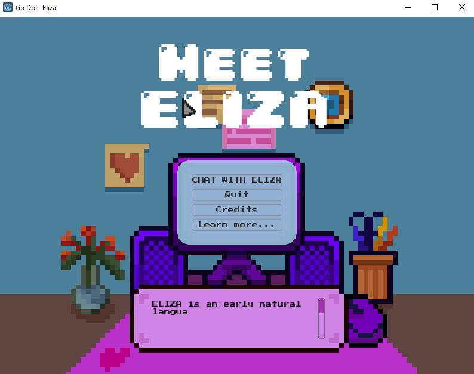
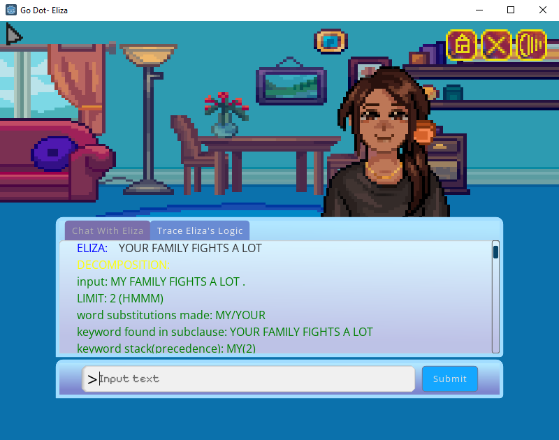

# GoDot-Eliza
 A Godot Implementation of JB's 1966 Eliza Chatbot

# GoDot-Eliza

A modern reimagining of the classic chatbot ELIZA, implemented using the GoDot game engine. Dive into a world of questionable therapy sessions with our pixelated art style and soothing background music. Don't use this as an actual therapy device if you need help - you are worth more than that. J.W. was mad about that too.

## Features

- **Classic ELIZA Experience**: Engage in conversation with ELIZA, a chatbot designed to mimic a Rogerian psychotherapist, offering reflective responses based on your input.
  
- **Pixelated Art Style**: Immerse yourself in a retro-inspired visual environment, where ELIZA is personified as a therapist in a 2D therapy room, and you play the role of the patient.

- **Background Music**: Enjoy chilled lo-fi ambient background music designed to draw out the profound.

- **Interactive Menu**: Access various options through a standard menu interface, complete with animations and pixel art elements.

## About

GoDot-Eliza is a term project developed by a team of four computer science students from Georgia Southern University. As a learning project, we aimed to merge classic concepts with modern game development techniques, resulting in an engaging and educational experience.

## Development Team

- Hunter W - ...Lead Developer?
- Kristin U - Art Director
- Jalyn Austin - UI Design
- Ves Sprole - Original Idea + Quality Assurance

## Getting Started

You can try GoDot-Eliza through one of our releases.

## Feedback and Contributions

We welcome feedback from users to improve the project further. Whether anything will happen due to this feedback is entirely up to fate.

## Acknowledgments

We would like to express our gratitude to Joseph Weizenbaum for creating the original ELIZA chatbot, which inspired this project. Additionally, we thank the Godot community for their support and resources that facilitated the development process. Please bring pythonscript to GoDot 4.

A special thanks to Harris Heller @ https://www.youtube.com/harrisheller for providing the royalty free background music for this project.

